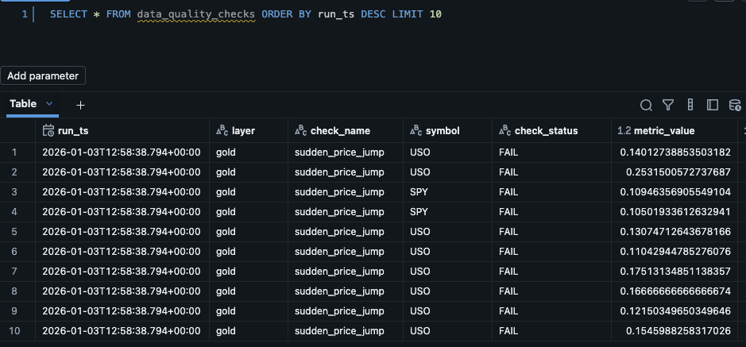
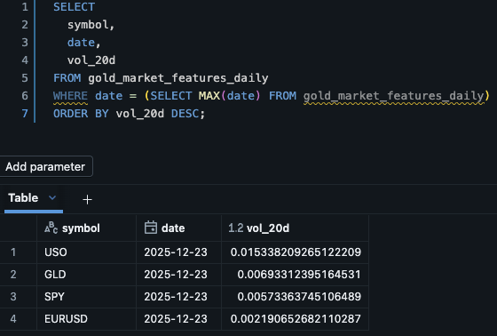
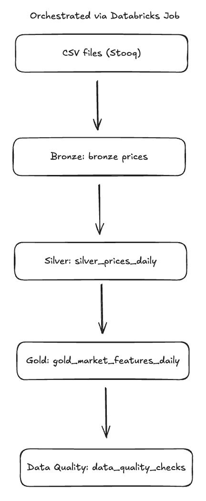
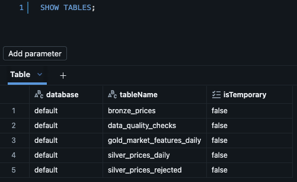

# Market Data Pipeline (Databricks · SQL · Delta Lake)

## Problem
Quant and trading teams rely on **clean, reliable market data** for pre-trade analysis.
In practice, raw market data is noisy:
- inconsistent schemas
- missing trading days
- duplicates
- silent data gaps

Without a structured pipeline, analysts spend time validating data instead of making decisions.

---

## Solution
This project implements a **Databricks-native, SQL-first data pipeline** that transforms raw market data into **analytics-ready Delta tables** with built-in data quality checks.

The pipeline follows a standard **Bronze → Silver → Gold** architecture and is orchestrated using a Databricks Job.

Python is used only for orchestration and validation logic.  
All delivered datasets are consumed via **SQL**.

---

## Delivered Data Products

### Bronze — Raw Ingestion
**Table:** `bronze_prices`

- Raw OHLC(V) market data
- File-level provenance (`source`, `ingested_at`, `input_file`)
- Idempotent ingestion via MERGE

**Purpose:** system of record, debugging, backfills

---

### Silver — Cleaned & Normalized
**Table:** `silver_prices_daily`

Guarantees:
- one row per `(symbol, date)`
- typed numeric columns
- deduplicated records
- validated OHLC consistency
- nullable volume for FX instruments

**Purpose:** trusted daily price base for analytics

---

### Gold — Analytics-Ready Features
**Table:** `gold_market_features_daily`

Features:
- daily returns
- rolling 20-day volatility
- rolling 20-day average volume (liquidity proxy)

**Purpose:** pre-trade monitoring, risk scans, feature inputs

---

### Data Quality & Monitoring
**Table:** `data_quality_checks`

Checks recorded on every run:
- missing trading day gaps
- sudden price jumps
- stale data detection
- pipeline row counts

**Purpose:** operational reliability and auditability

---

## How This Supports Pre-Trade Analysis
The Gold table enables analysts to:
- scan current volatility regimes
- detect unusual price moves
- filter assets by liquidity
- query consistent, validated time series without Python

All outputs are SQL-queryable and suitable for downstream analytics or modeling.

---

## Architecture

---

## Orchestration
The pipeline is orchestrated using a **Databricks Job** with a linear dependency:

01_ingest_bronze
→ 02_transform_silver
→ 03_aggregate_gold
→ 04_data_quality_checks

The job can be scheduled to run daily to refresh analytics-ready tables.

---

## How to Run
1. Create a Databricks Community Edition workspace
2. Import notebooks from `/notebooks`
3. Either:
   - run notebooks manually in order, or
   - run the Databricks Job `market-data-pipeline`
4. Query outputs via SQL (see `/sql/example_queries.sql`)

---

## Non-Goals
- No machine learning models
- No dashboards or UI
- Focus on **SQL-first data products**, correctness, and reliability